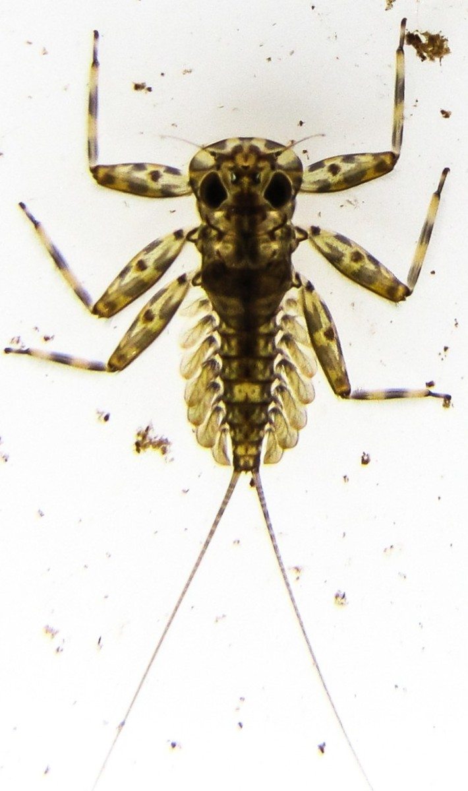
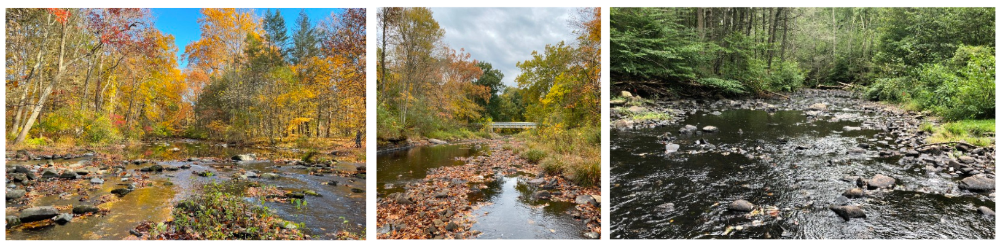
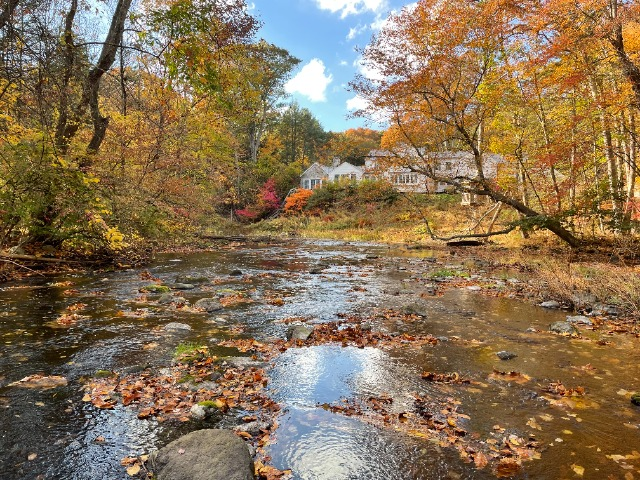
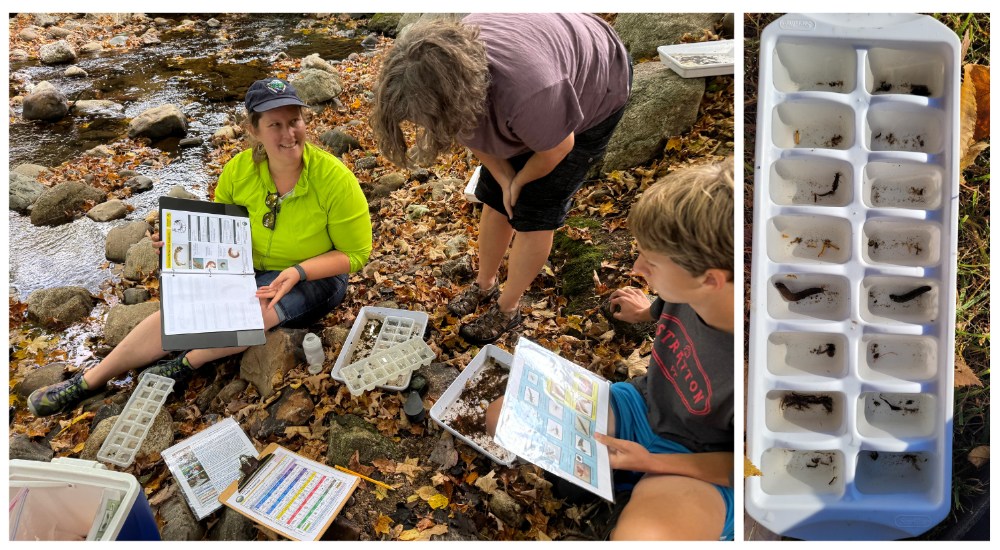
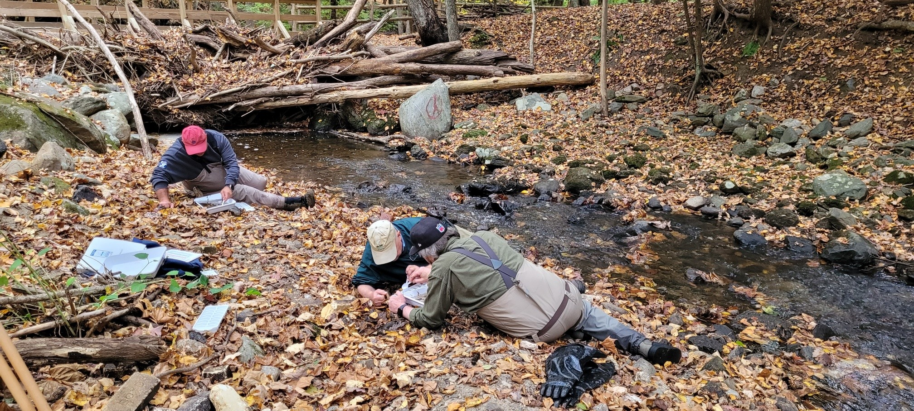

```{r setup, include = FALSE}
knitr::opts_chunk$set(echo = FALSE, message = FALSE, warning = FALSE)

### Multiple Files need to be updated to run this script, most are made in the RBV Metrics Script, but may need to be edited/ reformatted ###
# 1. Latest csv file of awx stations, can just copy the one used in the metrics script
# 2. Summarystats.csv: this is the summary stats over the years and is calculated in metrics script, double check these stats for accuracy (especially with # of waterbodies, r can only count unique waterbody names/ can't take added detail into account)
# 3. Presence_absence_report.xlsx: this also needs to be manually updated using PresentAbsent_Reformat file, only requires some reformatting that is easier to do in excel
# 4. groups.csv: this also has to be manually created using the groups.csv made from RBV Metrics script, just to add the coordinators and reformat the file 
# 5. RBV_Summary_2024: this is taken directly from the metrics script output
# 6. Lastest copies of the assessed rivers layers for the map
# 7. summarybysite_code: directly from metrics script (for this file to work in metrics you need to first update groups.csv so it has the codes for each org, can possibly add that to the metrics script)
# 8. sitesforreport.csv: taken directly from metrics script and copied over
# 9. RBV_MostWantedBySite_2024.csv: This is directly from the metrics script, just has to be copied to report folder 
# 10. New photos using a combination of submitted photos from survey123 form and photos found here: M:\Volunteer Monitoring\RBV PROGRAM\Photographs

## Other tasks ##
# read and edit paragraphs written in report 
# determine new waterbody segments for the "RBV impact" section, in the map section of this report there is a "Sites_AssessedRivers" file that is created that matches RBV sampling location segments with existing assessed segments, then subsets into only 4+ taxa sites, the sites without a match can then be manually checked using the mapping application to see if they have really not been assessed. 


library(stringr)
library(dplyr)
library(leaflet)
library(sf)
library(DT)
library(kableExtra)
```
<div class = "section">

[{width=2000px}](https://portal.ct.gov/deep/water/inland-water-monitoring/riffle-bioassessment-by-volunteers-rbv)

# 2024 Riffle Bioassessment by Volunteers Program Report

<div style="float: right; margin-left: 10px;">

<p class = "caption">Two-Tailed Mayfly (Epeorus)</p>
</div>

<i>Report Last Updated: `r format(Sys.Date(), '%B %Y')`</i>

Connecticut is fortunate to be a water-rich state, home to over 7,772 miles of rivers and streams. One of the [CT DEEP Monitoring and Assessment Program’s (MAP)](https://portal.ct.gov/deep/water/inland-water-monitoring/water-quality-monitoring-program) primary tasks is to conduct water quality monitoring to evaluate the physical, chemical and biological conditions of all waters in the State as part of Clean Water Act (CWA) requirements. Given limited staff resources, this wealth of water resources presents a challenge to achieve this CWA goal. One way MAP has enhanced assessments is by utilizing citizen scientist data to work towards this goal. 

In 1999, the MAP developed a citizen science program, called the [Riffle Bioassessment by Volunteers (RBV) Program](https://portal.ct.gov/deep/water/inland-water-monitoring/riffle-bioassessment-by-volunteers-rbv), where trained volunteers collect benthic macroinvertebrate data from wadeable streams. In 2024 we entered the 26th consecutive sampling year for RBV program data. **Thank you all for your hard work that allows this program to continue to be a success!**

<br>



<div class = "caption">Above: Various 2024 RBV sampling locations (Left: Saugatuck River, Weston, Middle: Jeremy River, Colchester, Right: Eightmile River (West Branch), Haddam). Photos courtesy of Harbor Watch, Salmon River Watershed Partnership & Eightmile River Wild & Scenic Watershed.
</div>

<hr>

## A Hunt for CT’s Healthiest Streams! 

The CT DEEP Riffle Bioassessment by Volunteers or “RBV” Program is an annual fall ‘treasure hunt’ for Connecticut’s healthiest streams.  CT DEEP uses the data collected by RBV volunteers to expand its inventory of excellent small, high gradient Connecticut streams that have excellent water quality – our “Healthy Streams” list.  

RBV volunteers examine the water quality of local stream segments by studying the aquatic benthic macroinvertebrate community present in rocky or ‘riffle’ areas of these streams.  If volunteers can find four or more pollution sensitive or ‘most wanted’ macroinvertebrates, CT DEEP can use this data to assess that stream as fully supporting water quality standards for aquatic life use – documenting it as one of CT’s healthiest streams!  

Because it is a screening approach and not a more in-depth assessment methodology, RBV cannot provide a detailed water quality assessment, nor can it be used to identify low or impaired water quality.


<div class = "caption">Above left: Volunteers sampling at Lewis Atwood Brook, Woodbury. Above right: Volunteers sampling at Sprain Brook, Woodbury. Photos courtesy of the Pomperaug River Watershed Coalition. </div>

<hr>

## 2024 Local RBV Programs & Leaders 

Local RBV Programs ensure that the statewide RBV program is a success each year.  Local RBV Coordinators put countless hours into organizing their programs, communicating with DEEP, recruiting and training volunteers, and more.   


```{r groups, echo=FALSE}
groups <- read.csv("groups.csv", header = TRUE, encoding = "latin1") #this needs to be manually updated with new groups

knitr::kable(groups, col.names = gsub("[.]", " ", names(groups)), table.attr = "class=\"striped\"", format = "html")
```
<p></p>

<div class = "section">

<div style="float: left; margin-right: 15px; margin-top: 20px;">

<p class = "caption">Saugatuck River, Weston. <br> Photo courtesy of Harbor Watch. </p>
</div>

### Welcome New Groups!

The RBV Program is excited to welcome two new groups, **Harbor Watch** and **The Maritime Aquarium**!

Both groups received training and conducted samples in 2024 and we are happy to welcome them to the program! These partnerships are very beneficial in expanding the program reach to new waterbodies across CT. Thank you to our new and existing partners! 

</div>

<hr>

## 2024 Monitoring Results

The 2024 RBV monitoring program faced numerous challenges, including CT DEEP staffing changes and severe flooding in parts of the state followed by abnormally dry conditions which resulted in variable stream flows. Despite these unpredictable sampling conditions, the program continued to have a positive impact and contributed meaningful data to the Department of Energy and Environmental Protection.  

RBV volunteers collected **62** vouchers from **54** unique locations on **45** different waterbodies. **35 (56%)** of the 2024 monitoring vouchers had 4 or more taxa types in the ‘most wanted’ category, indicating that these stream segments are among Connecticut’s healthiest streams.   


### Table 1: Summary of Results

```{r summary, echo=FALSE}
summary <- read.csv("summarystats.csv", check.names = FALSE) #taken from metrics script, double check stats for accuracy

knitr::kable(summary,  table.attr = "class=\"striped\"", format = "html", align = c("l", rep("c", ncol(summary) - 1))) %>%
  column_spec(ncol(summary), background = "#00AAE7",bold = TRUE)
```

<br>


<div class = "caption">Above left: Volunteers processing samples at East Spring Brook, Bethlehem. Above right: Sample contents collected at Deep Brook, Newtown. Photos courtesy of the Pomperaug River Watershed Coalition and Trout Unlimited - Candlewood Valley Chapter. </div>

### 2024 Results Map

This **interactive** map depicts the number of ‘Most Wanted’ macroinvertebrate types present in RBV voucher samples from only 2024 samples.  Mouse over the site icon to see the monitoring ID, waterbody name, and count of most wanted taxa. To open the full-screen map, click [here](RBVmap2024.html).

Sites are assessed to be ‘healthy’ (<span class = "star">★</span>) if 4 or more ‘most wanted’ macroinvertebrate taxa were present.  View the full [Volunteer Monitoring Mapping Application](https://ctdeepwatermonitoring.github.io/Volmon-Map-App/) to see the results from all 26 years of monitoring.

```{r map, echo=FALSE}

data <- read.csv("RBV_Summary_2024.csv") #this will need to be updated to 2024, generated from metrics script
sites <- read.csv("awx_stations_webservice2024.csv")#this needs to be the latest version of the awx stations
colnames(sites)[1] <- ("AWQ..Station")
data <- merge(data, sites, by = "AWQ..Station")

rivers <- read_sf(dsn = ".", layer = "CT_305b_Assessed_River_2022")
rivers <- st_transform(rivers, crs = 4326) #this was giving me some funky errors

fullaql <- rivers %>% 
  filter(CT2022_A_1 == "Fully Supporting")

bad <- rivers %>% 
  filter(CT2022_A_1 == "Not Supporting") 


CT <- read_sf(dsn = ".", layer = "cb_2022_us_state_500k")
CT <- subset(CT, CT$STUSPS == "CT")
CT <- st_transform(CT, crs = 4326)

circle <- makeIcon(
  iconUrl = "circle marker.png", # Replace with actual URL or path to the icon
  iconWidth = 15, iconHeight = 15
)

yellow_star <- makeIcon(
  iconUrl = "map marker.png", # Replace with actual URL or path to the icon
  iconWidth = 22, iconHeight = 22
)

data$icon <- ifelse(data$RBV_most_wanted_count <= 3, "circle", "yellow_star")

data_black_circle <- data %>% filter(icon == "circle")
data_yellow_star <- data %>% filter(icon == "yellow_star")

legend_labels <- c("Sites with 3 or less MW", "Sites with 4+ MW", "Rivers supporting full AQL", "Impaired rivers for AQL")
legend_colors <- c("#0D2D6C", "#F2AB19", "#00AAE7", "darkred")

leaflet(options = leafletOptions(minZoom = 8, maxZoom = 16)) %>%
  setView(lng = -72.3246, lat = 41.69601, zoom = 8.4) %>%
  addTiles(group = 'Open Street Map') %>%
  addProviderTiles('Esri.WorldImagery', group = "World Imagery") %>%
  addProviderTiles("Esri.WorldGrayCanvas", group = "Esri GrayCanvas (default)") %>%
  addPolylines(data = fullaql, color = "#00AAE7", label = ~ASSESSME_1, opacity = 1, weight = 1.5, group = "Rivers") %>%
  addPolylines(data = bad, color = "darkred", label = ~ASSESSME_1, opacity = 1, weight = 1.5, group = "Rivers") %>%
  addPolylines(data = CT, color = "black", opacity = 1, weight = 1.5) %>%
  addMarkers(
    data = data_black_circle,
    ~xlong,
    ~ylat,
    icon = circle,
    label = ~lapply(paste0(AWQ..Station, ": ", WaterbodyName.x, "<br>", "MW Count: ", "<b>", RBV_most_wanted_count, "</b>"), htmltools::HTML),
    labelOptions = labelOptions(permanent = FALSE, direction = "top",
                                style = list("font-size" = "12px")),
    group = 'Sites with 3 or less MW'
  ) %>%
  addMarkers(
    data = data_yellow_star,
    ~xlong,
    ~ylat,
    icon = yellow_star,
    label = ~lapply(paste0(AWQ..Station, ": ", WaterbodyName.x, "<br>", "MW Count: ", "<b>", RBV_most_wanted_count, "</b>"), htmltools::HTML),
    labelOptions = labelOptions(permanent = FALSE, direction = "top",
                                style = list("font-size" = "12px")),
    group = 'Sites with 4+ MW'
  ) %>%
  addLegend(
    position = "bottomright",
    colors = legend_colors,
    labels = legend_labels,
    title = "Legend"
  ) %>%
  addLayersControl(
    baseGroups = c('Esri GrayCanvas (default)', 'Open Street Map', 'World Imagery'),
    overlayGroups = c('Sites with 3 or less MW', 'Sites with 4+ MW', 'Rivers'),
    options = layersControlOptions(collapsed = FALSE)
    
  )


colnames(rivers)[3] <- "adbSegID"
new_rivers <- merge(data, rivers, by = "adbSegID", all.x = TRUE)
new_rivers <- new_rivers[new_rivers$icon == "yellow_star",]
new_rivers <- new_rivers[c("adbSegID", "AWQ..Station", "WaterbodyName.x", "Municipality", "DATE_COL", "RBV_most_wanted_count", "ylat", "xlong", "stationsCommentTxt", "lastUpdateDate", "CT2022_A_1")]
write.csv(new_rivers, "Sites_AssessedRivers.csv", row.names = FALSE)
```

### Table 2: Most Wanted Counts

This table provides a list of most wanted counts by site. The table is sorted according to waterbody name, site ID, and then the date the sample was collected.

A detailed list of all monitoring sites, most wanted counts and the complete RBV taxa list for each can be downloaded from the [Water Quality Portal](https://www.waterqualitydata.us/).

```{r summarybysite, echo=FALSE, out.width="100%"}
summarybysite <- read.csv("summarybysite_code.csv") #from rbv metrics script

colnames(summarybysite)[2] <- "Station.ID"
summarybysite$Station.ID <- as.character(summarybysite$Station.ID)
summarybysite$RBV_most_wanted_count <- as.character(summarybysite$RBV_most_wanted_count)
colnames(summarybysite) <- c("Waterbody Name", "Station ID", "Group Code", "Date Collected", "Most Wanted Count")

##Will have to change the number of sites (62)
datatable(head(summarybysite, 62), colnames = gsub("[.]", " ", names(summarybysite)), options = list(
  pageLength = 10, lengthChange = FALSE,
  lengthMenu = c(20)
))
```

<br>


<div class = "caption">Above left: Volunteers sampling at Mashamoquet Brook, Pomfret. Above right: Volunteers sorting samples at Good Hill Brook, Woodbury. Photos courtesy of the The Last Green Valley and Pomperaug River Watershed Coalition. </div>

<hr>

## Interpreting Your Results 

Refer to Table 3 for guidance on how to interpret your monitoring results. 

### Table 3: Interpretation of RBV Results by Most Wanted Count

<table border="2" style="border-collapse: collapse; border-color: black;">
  <tr style="background-color: #0D2D6C; color: white; text-align: center;">
    <td style="font-size: 14px; padding: 8px; border: 2px solid black;"># ‘Most Wanted’ Taxa</td>
    <td style="font-size: 28px; padding: 8px; border: 2px solid black;">What Does it Tell Us?</td>
  </tr>
  <tr style="background-color: #23AE49; color: white;">
  <td style="font-size: 26px; text-align: center; border: 2px solid black;">4+</td>
  <td style =" padding: 8px; border: 2px solid black;"><b><i>Excellent!!  Lots of very sensitive macroinvertebrate types were present – you found a healthy stream segment!</b></i>
  <br>
  <br>
This is a very clear signal of excellent water quality as the ‘Most Wanted’ types cannot survive in degraded streams or otherwise low water quality conditions.  
<br>
<b>DEEP Assessment Decision:</b> The stream containing the monitoring location will be considered for ‘Fully Supporting’ State aquatic life use standards.  Fully supporting streams or stream segments will be listed in the next Integrated Water Quality Report (IWQR) and added to the DEEP’s running list of miles of Healthy Waters assessed.  
<br>
<b>Recommended Volunteer Follow-Up Action:</b>  Revisit every 2 to 5 years to continue documenting the excellent health of this stream. 
</td>
  </tr>
  <tr style="background-color: #FDB515; color: white;">
    <td style="font-size: 26px; text-align: center; border: 2px solid black;">3</td>
     <td style =" padding: 8px; border: 2px solid black;"><b><i>A Very Good Sign – Keep this Site on Your Radar! </b></i>
    <br><br>
Three Most Wanted or very sensitive macroinvertebrate types in a sample is a strong signal of good to excellent water quality.   Although three most wanted is not statistically enough data for DEEP to list the site as a healthy stream segment this time, this is a great find!
<br><br>
<b>DEEP Assessment Decision:</b> No Assessment Made… but consider trying again! 
<br><br>
<b>Recommended Volunteer Follow-Up Action:</b>  If this was the first time the site was monitored with RBV, this site should be a high priority candidate for next season.  
</td>

  </tr>
  <tr style="background-color: #00AAE7; color: #0D2D6C;">
    <td style="font-size: 26px; text-align: center; border: 2px solid black;">0-2</td>
     <td style =" padding: 8px; border: 2px solid black;"><b><i>Double check whether this is a good spot to be using the RBV method… </b></i>
    <br><br>
More information is needed to determine the water quality at this site.  Reasons for few most wanted could include poor water quality; however, few most wanted types should not be interpreted as a proof of degraded conditions.  Other factors such as unusual flow conditions and lack of adequate habitat can also result in few most wanted types despite overall good water quality.
<br><br>
<b>DEEP Assessment Decision:</b> No Assessment Made
<br><br>
<b>Recommended Volunteer Follow-Up Action:</b>   Discuss with the State RBV Coordinator whether you should revisit this site in future monitoring seasons.  
</td>
  </tr>
</table>

<hr>

## 2024 RBV Data Impact

The 2024 RBV results will be consolidated into the 2026 [Integrated Water Quality Report](https://portal.ct.gov/deep/water/water-quality/water-quality-305b-report-to-congress).  A ‘healthy’ river or stream is one that fully supports a variety of uses, including aquatic life use.   

In 2024, RBV volunteers monitored 62 waterbodies in Connecticut.  Based on the results reported in the previous section, RBV data is likely to generate **4 new listings** of Connecticut waterbodies that fully support aquatic life use: 

1. Mill Brook (Woodstock)

2. Blackmore Brook (Thompson)

3. North Branch Pootatuck River (Newtown)

4. NTT to Eightmile River (East Haddam)

In addition, the 2024 RBV data will allow DEEP to propose maintaining **24 existing waterbodies** that fully support aquatic life use.
<br>



<div class = "caption">Above: Volunteers sorting RBV samples at Deep Brook, Newtown. Photo courtesy of Trout Unlimited - Candlewood Valley Chapter. </div>

<hr>

## Appendices {.tabset}

### Appendix A: Monitoring Station Details 

```{r sites, echo=FALSE, out.width="100%"}

sites <- read.csv("sitesforreport.csv") #adapted from upload_stations from metrics script

sites$Station.ID <- as.character(sites$Station.ID)
sites$Municipality <- str_to_title(sites$Municipality)
## will have to change the number of sites to match (62)
datatable(head(sites, 62), colnames = gsub("[.]", " ", names(sites)), options = list(
  pageLength = 10, lengthChange = FALSE,
  lengthMenu = c(20)
))
```

### Appendix B: Most Wanted Taxa by Site

This table provides a list of all the "most wanted" taxa found at each site. The table is sorted according to waterbody name, site ID, and then the date the sample was collected. A full list of all taxa found at each site can be downloaded from the [Water Quality Portal](https://www.waterqualitydata.us/).


```{r mwbysite, echo=FALSE, out.width="100%"}
mwbysite <- read.csv("RBV_MostWantedBySite_2024.csv") #from metrics script, update to 2024

colnames(mwbysite) <- c("LabID", "Station.ID", "Waterbody Name", "Date Collected", "Family", "Final ID")
mwbysite <- mwbysite[c("Waterbody Name", "Station.ID", "Date Collected", "Family", "Final ID")]
mwbysite$Station.ID <- as.character(mwbysite$Station.ID)

#### will have to change number of rows (248) to match
datatable(head(mwbysite, 248), colnames = gsub("[.]", " ", names(mwbysite)), options = list(
  pageLength = 20, lengthChange = FALSE,
  lengthMenu = c(20)
))
```

### Appendix C: Presence/Absence of RBV Taxa by Site

To download this supplementary table, click [here](presence_absence_report_2024.xlsx). Samples are sorted by waterbody name, site ID and then monitoring date.  ‘Most Wanted’ taxa confirmed present in the voucher are noted with an “X”.  Column numbers correspond to the RBV macroinvertebrate organism ID number on the [RBV ID cards](https://portal.ct.gov/-/media/deep/water/volunteer_monitoring/rbv/rbv-macroinvertebrateidcards.pdf) and [datasheet](https://portal.ct.gov/sitecore/content/portal/DEEP/Water/Inland-Water-Monitoring//-/media/deep/water/volunteer_monitoring/rbv/rbv-fielddatasheet.pdf).  


Bold font indicates a site at which four or more ‘Most Wanted’ RBV taxa types were present in the voucher. There are 17 possible most wanted taxa; each miscellaneous small stonefly taxa present (up to 6 types) count as one ‘Most Wanted’ taxa type.  The site with the greatest number of ‘Most Wanted’ taxa types is highlighted in green. 
