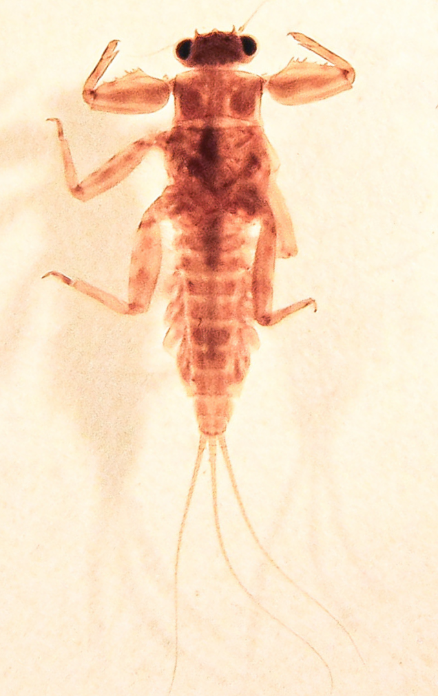
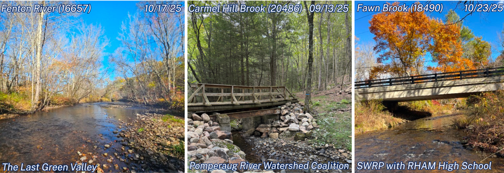
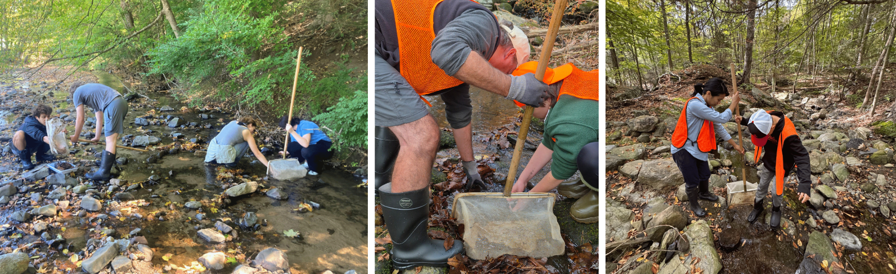
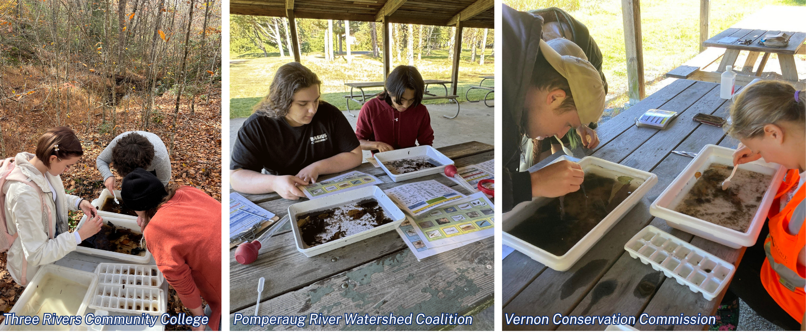
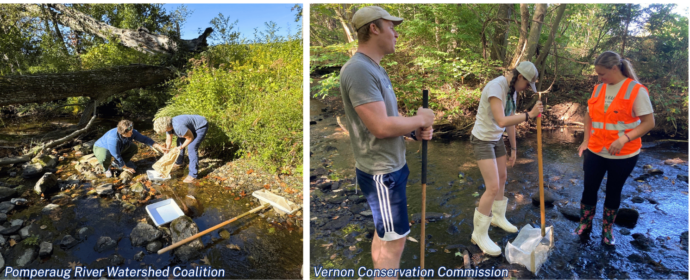
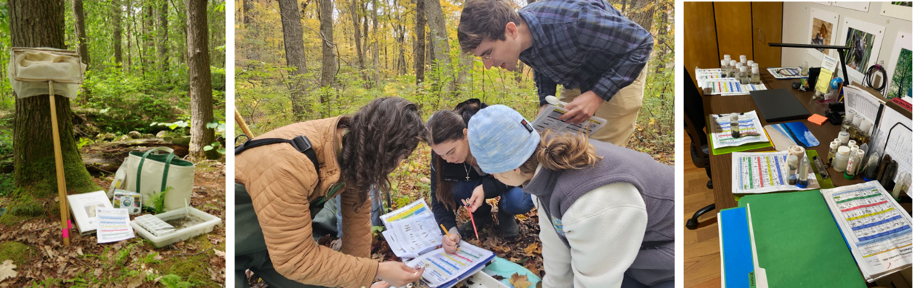

```{r setup, include = FALSE}
knitr::opts_chunk$set(echo = FALSE, message = FALSE, warning = FALSE)

### Multiple Files need to be updated to run this script, most are made in the RBV Metrics Script, but may need to be edited/ reformatted ###

## for 2026 Thank PRWC for their 20th year of consecuative sampling! Include image of bug cake!

# 1. Summarystats2025.csv: this is the summary stats over the years and is calculated in metrics script, double check these stats for accuracy (especially with # of waterbodies, r can only count unique waterbody names/ can't take added detail into account)
# 2. Presence_absence_report2025.xlsx: this also needs to be manually updated using PresentAbsent_Reformat file, only requires some reformatting that is easier to do in excel
# 3. groups.csv: this also has to be manually created using the groups.csv made from RBV Metrics script, just to add the coordinators and reformat the file 
# 4. RBV_Summary_2025: this is taken directly from the metrics script output
# 5. Lastest copies of the assessed rivers layers for the map (just copy the Geodatabase file)
# 6. summarybysite_code: directly from metrics script (for this file to work in metrics you need to first update groups.csv so it has the codes for each org, can possibly add that to the metrics script)
# 7. sitesforreport.csv: taken directly from metrics script and copied over
# 8. RBV_MostWantedBySite_2025.csv: This is directly from the metrics script, just has to be copied to report folder 
# 9. New photos using a combination of submitted photos from survey123 form and photos found here: M:\Volunteer Monitoring\RBV PROGRAM\Photographs

## Other tasks ##
# read and edit paragraphs written in report 
# determine new waterbody segments for the "RBV impact" section, in the map section of this report there is a "Sites_AssessedRivers" file that is created that matches RBV sampling location segments with existing assessed segments, then subsets into only 4+ taxa sites, the sites without a match can then be manually checked using the mapping application to see if they have really not been assessed. 


library(stringr)
library(dplyr)
library(leaflet)
library(leaflet.extras)
library(sf)
library(DT)
library(kableExtra)
library(DBI)
library(odbc)
library(keyring)
```
<div class = "section">

[{width=2000px}](https://portal.ct.gov/deep/water/inland-water-monitoring/riffle-bioassessment-by-volunteers-rbv)

# 2025 Riffle Bioassessment by Volunteers Program Report

<div style="float: right; margin-left: 10px; text-align: center;"> 
   
  <p class="caption" style="font-size: 11px !important; margin-top: 5px;">Body-Builder Mayfly <br> (Drunella sp.) </p> 
</div>

<i>Report Last Updated: `r format(Sys.Date(), '%B %Y')`</i>

Connecticut is fortunate to be a water-rich state, home to over 7,772 miles of rivers and streams. One of the [CT DEEP Monitoring and Assessment Program’s (MAP)](https://portal.ct.gov/deep/water/inland-water-monitoring/water-quality-monitoring-program) primary tasks is to conduct water quality monitoring to evaluate the physical, chemical and biological conditions of all waters in the State as part of Clean Water Act (CWA) requirements. Given limited staff resources, this wealth of water resources presents a challenge to achieve this CWA goal. One way MAP has enhanced assessments is by utilizing citizen scientist data to work towards this goal. 

In 1999, the MAP developed a citizen science program, called the [Riffle Bioassessment by Volunteers (RBV) Program](https://portal.ct.gov/deep/water/inland-water-monitoring/riffle-bioassessment-by-volunteers-rbv), where trained volunteers collect benthic macroinvertebrate data from wadeable streams. 2025 is our 27th consecutive sampling year for the RBV program and we are so grateful to have dedicated volunteers that continue to collect this meaningful data. **Thank you for all your hard work in making this another successful year!**

<br>



<div class = "caption">Above: Various 2025 RBV sampling locations (Left: Fenton River, Mansfield, Middle: Carmel Hill Brook, Woodbury, Right: Fawn Brook, Marlborough). Photos courtesy of The Last Green Valley, Pomperaug River Watershed Coalition & Salmon River Watershed Partnership.
</div>

<hr>

## A Hunt for CT’s Healthiest Streams! 

The CT DEEP Riffle Bioassessment by Volunteers or “RBV” Program is an annual fall ‘treasure hunt’ for Connecticut’s healthiest streams.  CT DEEP uses the data collected by RBV volunteers to expand its inventory of excellent small, high gradient Connecticut streams that have excellent water quality – our “Healthy Streams” list.  

RBV volunteers examine the water quality of local stream segments by studying the aquatic benthic macroinvertebrate community present in rocky or ‘riffle’ areas of these streams.  If volunteers can find four or more pollution sensitive or ‘most wanted’ macroinvertebrates, CT DEEP can use this data to assess that stream as fully supporting water quality standards for aquatic life use – documenting it as one of CT’s healthiest streams!  

Because it is a screening approach and not a more in-depth assessment methodology, RBV cannot provide a detailed water quality assessment, nor can it be used to identify low or impaired water quality.



<div class = "caption">Above: Volunteers from Pomperaug River Watershed Coalition (Left & Right) and The Last Green Valley (Middle) collecting macroinvertebrate samples. Photos courtesy of Pomperaug River Watershed Coalition and The Last Green Valley. </div>

<hr>

## 2025 Local RBV Programs & Leaders 

Local RBV Programs ensure that the statewide RBV program is a success each year.  Local RBV Coordinators put countless hours into organizing their programs, communicating with DEEP, recruiting and training volunteers, and more. The RBV Program would not be possible without these dedicated coordinators and the volunteers that care about our beautiful Connecticut streams - **thank you all!**


```{r groups, echo=FALSE}
groups <- read.csv("groups2025.csv", header = TRUE, encoding = "latin1") #this needs to be manually updated with new groups
knitr::kable(groups, col.names = gsub("[.]", " ", names(groups)), table.attr = "class=\"striped\"", format = "html") 
```
<p></p>

<div class = "section">

<div style="float: left; margin-right: 15px; margin-top: 25px; max-width: 260px;">
  
<p class = "caption" style="font-size: 11px:" > Jessica Landry (left) & Melissa Czarnowski (right) </p>
</div>

### New CT DEEP Volunteer Monitoring Group Staff

In 2025, CT DEEP had a change in the volunteer monitoring group staff, which brought a new RBV State Coordinator. Melissa Czarnowski is now the lead volunteer monitoring coordinator and Jessica Landry is assisting in the programs data management. We are both very excited to be apart of such a long-running and successful volunteer monitoring program!

We would like to thank you all for your patience as we adjust to these new roles, we look forward to continuing to grow this program and our connections with the dedicated RBV partners. 

</div>

<hr>

## 2025 Monitoring Results

The 2025 season marked another successful year of RBV sampling, the program continues to have a positive impact in contributing meaningful water quality data. Below highlights the successes of the 2025 sampling efforts. 

RBV volunteers collected **63** vouchers from **59** unique locations on **54** different waterbodies. **31 (49%)** of the 2025 monitoring vouchers had 4 or more taxa types in the ‘most wanted’ category, indicating that these stream segments are among Connecticut’s healthiest streams.   


### Table 1: Summary of Results

```{r summary, echo=FALSE}
summary <- read.csv("summarystats2025.csv", check.names = FALSE) #taken from metrics script, double check stats for accuracy

knitr::kable(summary, table.attr = 'class="striped"', format = "html", align = c('l', rep('c', ncol(summary)))) %>% 
  column_spec(ncol(summary), background = "#A2B5CD", bold = TRUE, include_thead = TRUE)
```

<br>



<div class = "caption"> Above: Volunteers from Three Rivers Community College (Left), Pomperaug River Watershed Coalition (Middle) and Vernon Conservation Commission (Right) sorting macroinvertebrate samples. Photos courtesy of Three Rivers Community College, Pomperaug River Watershed Coalition and Vernon Conservation Commission. </div>

### 2025 Results Map

This **interactive** map depicts the number of ‘Most Wanted’ macroinvertebrate types present in RBV voucher samples from only 2025 samples.  Mouse over the site icon to see the monitoring ID, waterbody name, and count of most wanted taxa. If there were multiple samples submitted for one station, the map will display the sample with the highest most wanted count. To open the full-screen map, click [here](RBVmap2025.html).

Sites are assessed to be ‘healthy’ (<span class = "star">★</span>) if 4 or more ‘most wanted’ macroinvertebrate taxa were present.  View the full [Volunteer Monitoring Mapping Application](https://ctdeepwatermonitoring.github.io/Volmon-Map-App/) to see the results from all 27 years of monitoring.

```{r map, echo=FALSE, message=FALSE}

## filter this map so when the visit a site twice in one year it only shows the highest score (the two 8mile PV Brook sites they sampled in the spring and fall)

### pulling most recent AWX stations
con <- dbConnect(odbc(), 
                 Driver = "MySQL ODBC 9.0 ANSI Driver", 
                 Server = "sdc-epafiling", 
                 Database = "awqx", 
                 Trusted_Connection = "True",
                 uid = key_list("sdc-epafiling")[1,2],
                 pwd = key_get("sdc-epafiling", "readonly_user"))

# Pull full list of stations from awX
site_select <- ("SELECT * FROM awqx.stations;")
sites <- dbGetQuery(con, site_select)
# Disconnect from database 
dbDisconnect(con)


data <- read.csv("RBV_Summary_2025.csv") #this will need to be updated to 2024, generated from metrics script
data <- merge(data, sites, by = "staSeq")

# since there are multiple samples at one site, I'm only keeping the highest value per site ID
data <- data %>%
    group_by(staSeq) %>%
    slice_max(order_by = RBV_most_wanted_count, n = 1, with_ties = FALSE) %>%
    ungroup()


# adding the assessment layer 
GIS_Segment <- "C:/Users/LandryJes/Documents/RBVReport/Annual_Report_Development_2025/CT 2024 IWQR Segments Final.gdb"
River_Layer = "CT2024IWQR_River_USES_FINAL"

# Reading in the geodatabase file
Rivers <- st_read(dsn = GIS_Segment, layer = River_Layer, quiet = TRUE)
Rivers <- st_transform(Rivers, crs = 4326)

# Assigning full/ not support to color code
fullaql <- Rivers %>% 
  filter(AQUATIC_LIFE_ATTAINMENT_2024 == "Fully Supporting")

bad <- Rivers %>% 
  filter(AQUATIC_LIFE_ATTAINMENT_2024 == "Not Supporting") 

# CT boundary layer
CT <- read_sf("ct_boundary.geojson")

circle <- makeIcon(
  iconUrl = "circle marker.png", 
  iconWidth = 15, iconHeight = 15
)

yellow_star <- makeIcon(
  iconUrl = "map marker.png", 
  iconWidth = 22, iconHeight = 22
)

data$icon <- ifelse(data$RBV_most_wanted_count <= 3, "circle", "yellow_star")

data_black_circle <- data %>% filter(icon == "circle")
data_yellow_star <- data %>% filter(icon == "yellow_star")

legend_labels <- c("Sites with 3 or less MW", "Sites with 4+ MW", "Rivers supporting full AQL", "Impaired rivers for AQL")
legend_colors <- c("#0D2D6C", "#F2AB19", "#00AAE7", "darkred")

leaflet(options = leafletOptions(minZoom = 8, maxZoom = 16)) %>%
  setView(lng = -72.3246, lat = 41.69601, zoom = 8.4) %>%
  addTiles(group = 'Open Street Map') %>%
  addProviderTiles('Esri.WorldImagery', group = "World Imagery") %>%
  addProviderTiles("Esri.WorldGrayCanvas", group = "Esri GrayCanvas (default)") %>%
  addPolylines(data = fullaql, color = "#00AAE7", label = ~ASSESSMENT_UNIT_NAME, opacity = 1, weight = 1.5, group = "Rivers") %>%
  addPolylines(data = bad, color = "darkred", label = ~ASSESSMENT_UNIT_NAME, opacity = 1, weight = 1.5, group = "Rivers") %>%
  addPolylines(data = CT, color = "black", opacity = 1, weight = 1.5) %>%
  addMarkers(
    data = data_black_circle,
    ~xlong,
    ~ylat,
    icon = circle,
    label = ~lapply(paste0(staSeq, ": ", WaterbodyName, "<br>", "MW Count: ", "<b>", RBV_most_wanted_count, "</b>"), htmltools::HTML),
    labelOptions = labelOptions(permanent = FALSE, direction = "top",
                                style = list("font-size" = "12px")),
    group = 'Sites with 3 or less MW'
  ) %>%
  addMarkers(
    data = data_yellow_star,
    ~xlong,
    ~ylat,
    icon = yellow_star,
    label = ~lapply(paste0(staSeq, ": ", WaterbodyName, "<br>", "MW Count: ", "<b>", RBV_most_wanted_count, "</b>"), htmltools::HTML),
    labelOptions = labelOptions(permanent = FALSE, direction = "top",
                                style = list("font-size" = "12px")),
    group = 'Sites with 4+ MW'
  ) %>%
  addLegend(
    position = "bottomright",
    colors = legend_colors,
    labels = legend_labels,
    title = "Legend"
  ) %>%
  addLayersControl(
    baseGroups = c('Esri GrayCanvas (default)', 'Open Street Map', 'World Imagery'),
    overlayGroups = c('Sites with 3 or less MW', 'Sites with 4+ MW', 'Rivers'),
    options = layersControlOptions(collapsed = FALSE)
  ) %>%  
   addMarkers(
    data = data, lng = ~xlong, lat = ~ylat, label = data$WaterbodyName,
    group = data$WaterbodyName,
    icon = makeIcon( 
      iconUrl = "http://leafletjs.com/examples/custom-icons/leaf-green.png",
      iconWidth = 1, iconHeight = 1
    )
  ) %>%
  addSearchFeatures(
    targetGroups = data$WaterbodyName, # group should match addMarkers() group
    options = searchFeaturesOptions(
      zoom=18, openPopup = TRUE, firstTipSubmit = TRUE,
      autoCollapse = TRUE, hideMarkerOnCollapse = TRUE,
      textPlaceholder = "Search by Waterbody Name..."
    )
  )


colnames(Rivers)[1] <- "adbSegID"
new_rivers <- merge(data, Rivers, by = "adbSegID", all.x = TRUE)
new_rivers <- new_rivers[new_rivers$icon == "yellow_star",]
new_rivers <- new_rivers[c("adbSegID", "staSeq", "WaterbodyName", "Municipality", "DATE_COL", "RBV_most_wanted_count", "ylat", "xlong", "stationsCommentTxt", "lastUpdateDate", "AQUATIC_LIFE_ATTAINMENT_2024")]
write.csv(new_rivers, "Sites_AssessedRivers.csv", row.names = FALSE)
### check this new rivers file with the stations map 2024 rivers layer to see if they are actually new for AQL, normally some are just new stations created so have yet to have a segment ID assigned 
```

### Table 2: Most Wanted Counts

This table provides a list of most wanted counts by site. The table is sorted according to waterbody name, site ID, and then the date the sample was collected.

A detailed list of all monitoring sites, most wanted counts and the complete RBV taxa list for each can be downloaded from the [Water Quality Portal](https://www.waterqualitydata.us/).

```{r summarybysite, echo=FALSE, out.width="100%"}
summarybysite <- read.csv("summarybysite_code2025.csv") #from rbv metrics script

colnames(summarybysite)[2] <- "Station.ID"
summarybysite$Station.ID <- as.character(summarybysite$Station.ID)
summarybysite$RBV_most_wanted_count <- as.character(summarybysite$RBV_most_wanted_count)
colnames(summarybysite) <- c("Waterbody Name", "Station ID", "Group Code", "Date Collected", "Most Wanted Count")

### Adding footnote for samples collected outside the QAPP, change year on date range!
startdate <- as.Date("2025-09-01")
enddate <- as.Date("2025-11-30")
summarybysite$Date<- as.Date(summarybysite$`Date Collected`, format = "%m/%d/%Y")

summarybysite <- summarybysite %>%
  mutate(footnote = ifelse(Date < startdate | Date > enddate, "*", ""))
summarybysite$`Waterbody Name` <- paste0(summarybysite$footnote, summarybysite$`Waterbody Name`)
summarybysite$footnote <- NULL
summarybysite$Date <- NULL

##Will have to change the number of sites (63)
datatable(head(summarybysite, 63), colnames = gsub("[.]", " ", names(summarybysite)), options = list(
  pageLength = 10, lengthChange = FALSE,
  lengthMenu = c(20)
))
```
<div class="caption">
*Data collected outside the sampling date range specified in the [QAPP](https://portal.ct.gov/-/media/deep/water/volunteer_monitoring/rbv/rbv-qapp2021.pdf?rev=8290983c9bfe453ab2f43171732fdda9&hash=57AF5564642C5FA188347B503596638F) (September 1st-November 30th).<br>
Data collected by Bolton Conservation Commission for Baker Brook & French Brook will be available at a later date, this report will be updated to reflect the results of those samples when the data is available. 
</div>




<div class = "caption">Above: Volunteers from Pomperaug River Watershed Coalition and Vernon Conservation Commission collecting samples. Photos courtesy of Pomperaug River Watershed Coalition and Vernon Conservation Commission. </div>

<hr>

## Interpreting Your Results 

Refer to Table 3 for guidance on how to interpret your monitoring results. 

### Table 3: Interpretation of RBV Results by Most Wanted Count

<table border="2" style="border-collapse: collapse; border-color: black;">
  <tr style="background-color: #0D2D6C; color: white; text-align: center;">
    <td style="font-size: 14px; padding: 8px; border: 2px solid black;"># ‘Most Wanted’ Taxa</td>
    <td style="font-size: 28px; padding: 8px; border: 2px solid black;">What Does it Tell Us?</td>
  </tr>
  <tr style="background-color: #23AE49; color: white;">
  <td style="font-size: 26px; text-align: center; border: 2px solid black;">4+</td>
  <td style =" padding: 8px; border: 2px solid black;"><b><i>Excellent!!  Lots of very sensitive macroinvertebrate types were present – you found a healthy stream segment!</b></i>
  <br>
  <br>
This is a very clear signal of excellent water quality as the ‘Most Wanted’ types cannot survive in degraded streams or otherwise low water quality conditions.  
<br>
<b>DEEP Assessment Decision:</b> The stream containing the monitoring location will be considered for ‘Fully Supporting’ State aquatic life use standards.  Fully supporting streams or stream segments will be listed in the next Integrated Water Quality Report (IWQR) and added to the DEEP’s running list of miles of Healthy Waters assessed.  
<br>
<b>Recommended Volunteer Follow-Up Action:</b>  Revisit every 2 to 5 years to continue documenting the excellent health of this stream. 
</td>
  </tr>
  <tr style="background-color: #FDB515; color: white;">
    <td style="font-size: 26px; text-align: center; border: 2px solid black;">3</td>
     <td style =" padding: 8px; border: 2px solid black;"><b><i>A Very Good Sign – Keep this Site on Your Radar! </b></i>
    <br><br>
Three Most Wanted or very sensitive macroinvertebrate types in a sample is a strong signal of good to excellent water quality.   Although three most wanted is not statistically enough data for DEEP to list the site as a healthy stream segment this time, this is a great find!
<br><br>
<b>DEEP Assessment Decision:</b> No Assessment Made… but consider trying again! 
<br><br>
<b>Recommended Volunteer Follow-Up Action:</b>  If this was the first time the site was monitored with RBV, this site should be a high priority candidate for next season.  
</td>

  </tr>
  <tr style="background-color: #00AAE7; color: #0D2D6C;">
    <td style="font-size: 26px; text-align: center; border: 2px solid black;">0-2</td>
     <td style =" padding: 8px; border: 2px solid black;"><b><i>Double check whether this is a good spot to be using the RBV method… </b></i>
    <br><br>
More information is needed to determine the water quality at this site.  Reasons for few most wanted could include poor water quality; however, few most wanted types should not be interpreted as a proof of degraded conditions.  Other factors such as unusual flow conditions and lack of adequate habitat can also result in few most wanted types despite overall good water quality.
<br><br>
<b>DEEP Assessment Decision:</b> No Assessment Made
<br><br>
<b>Recommended Volunteer Follow-Up Action:</b>   Discuss with the State RBV Coordinator whether you should revisit this site in future monitoring seasons.  
</td>
  </tr>
</table>

<hr>

## 2025 RBV Data Impact

The 2025 RBV results will be consolidated into a future [Integrated Water Quality Report](https://portal.ct.gov/deep/water/water-quality/water-quality-305b-report-to-congress).  A ‘healthy’ river or stream is one that fully supports a variety of uses, including aquatic life use.   

In 2025, RBV volunteers monitored 54 waterbodies in Connecticut.  Based on the results reported in the previous section, RBV data is likely to generate **7 new listings** of Connecticut waterbodies that fully support aquatic life use: 

1. Keach Brook (Putnam)

2. NNT to Blackledge River (Marlborough)

3. South Branch Bullet Hill Brook (Southbury)

4. Plumb Brook (Woodbury)

5. Fall Brook (Killingly)

6. Fraser Brook (Salem)

7. NNT to Eightmile River (East Haddam)

In addition, the 2025 RBV data will allow DEEP to propose maintaining **30 existing waterbodies** that fully support aquatic life use.
<br>



<div class = "caption">Above: Various photos taken during the 2025 RBV sampling season. Photos courtesy of CT DEEP, Greenwich Inland Wetlands & Watercourses Agency and Eightmile River Wild and Scenic Watershed. </div>

<hr>

## Appendices {.tabset}

### Appendix A: Monitoring Station Details 

```{r sites, echo=FALSE, out.width="100%"}

sites <- read.csv("sitesforreport2025.csv") #adapted from upload_stations from metrics script

sites$Station.ID <- as.character(sites$Station.ID)
sites$Municipality <- str_to_title(sites$Municipality)
## will have to change the number of sites to match (62)
datatable(head(sites, 63), colnames = gsub("[.]", " ", names(sites)), options = list(
  pageLength = 10, lengthChange = FALSE,
  lengthMenu = c(20)
))
```

### Appendix B: Most Wanted Taxa by Site

This table provides a list of all the "most wanted" taxa found at each site. The table is sorted according to waterbody name, site ID, and then the date the sample was collected. A full list of all taxa found at each site can be downloaded from the [Water Quality Portal](https://www.waterqualitydata.us/).


```{r mwbysite, echo=FALSE, out.width="100%"}
mwbysite <- read.csv("RBV_MostWantedBySite_2025.csv") #from metrics script, update to 2025

colnames(mwbysite) <- c("LabID", "Station.ID", "Waterbody Name", "Date Collected", "Family", "Final ID")
mwbysite <- mwbysite[c("Waterbody Name", "Station.ID", "Date Collected", "Family", "Final ID")]
mwbysite$Station.ID <- as.character(mwbysite$Station.ID)

#### will have to change number of rows (225) to match
datatable(head(mwbysite, 225), colnames = gsub("[.]", " ", names(mwbysite)), options = list(
  pageLength = 20, lengthChange = FALSE,
  lengthMenu = c(20)
))
```

### Appendix C: Presence/Absence of RBV Taxa by Site

To download this supplementary table, click <a href="presence_absence_report_2025.xlsx" download="presence_absence_report_2025.xlsx">here</a>. Samples are sorted by waterbody name, site ID and then monitoring date.  ‘Most Wanted’ taxa confirmed present in the voucher are noted with an “X”.  Column numbers correspond to the RBV macroinvertebrate organism ID number on the [RBV ID cards](https://portal.ct.gov/-/media/deep/water/volunteer_monitoring/rbv/rbv-macroinvertebrateidcards.pdf) and [datasheet](https://portal.ct.gov/-/media/deep/water/volunteer_monitoring/rbv/rbvdatasheet_2023v2.pdf).  


Bold font indicates a site at which four or more ‘Most Wanted’ RBV taxa types were present in the voucher. There are 17 possible most wanted taxa; each miscellaneous small stonefly taxa present (up to 6 types) count as one ‘Most Wanted’ taxa type.  The site with the greatest number of ‘Most Wanted’ taxa types is highlighted in green. 
